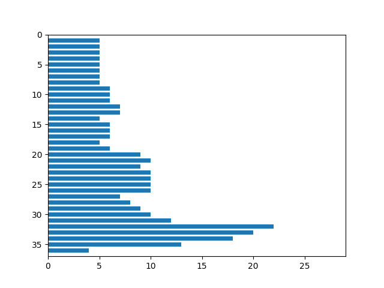
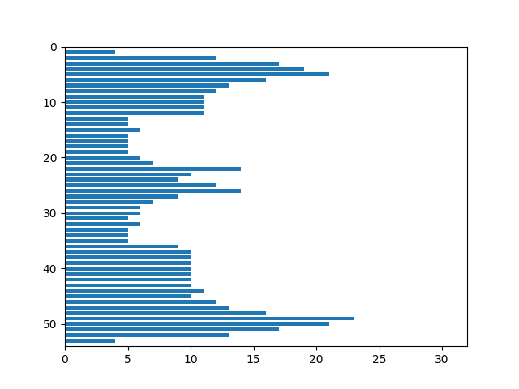
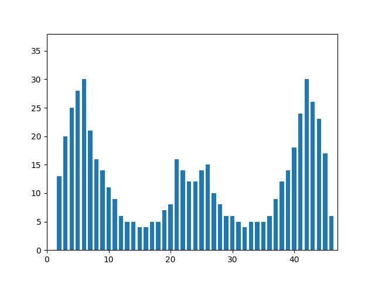
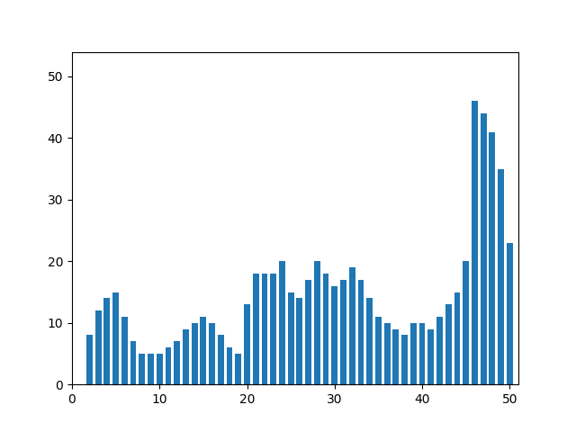
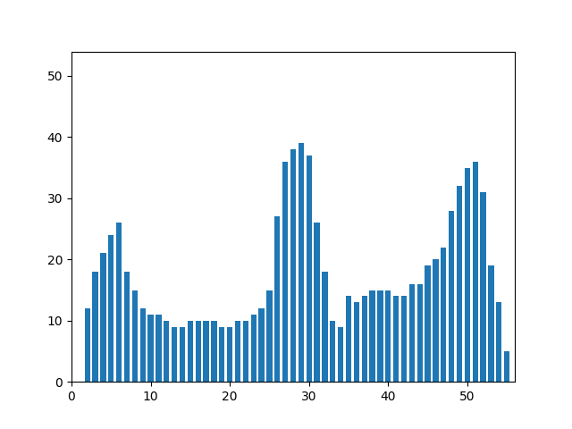
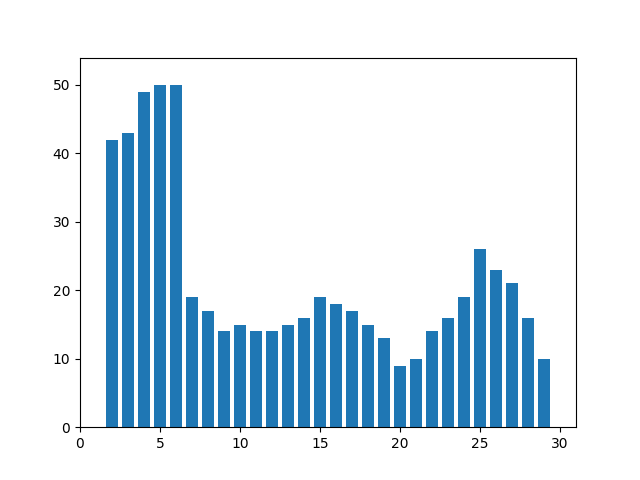
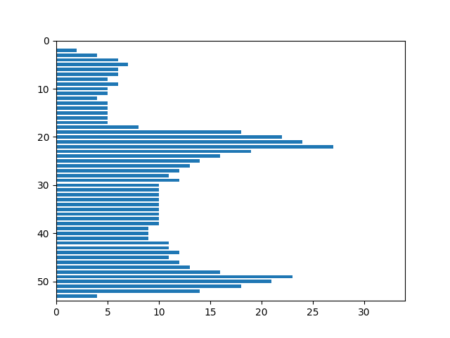
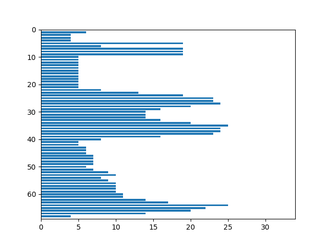
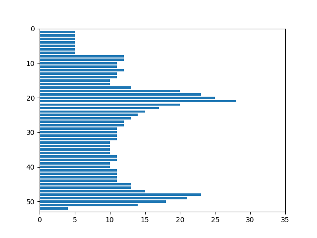

### Язык Грузинский
### Название шрифта Segoe UI
### Размер шрифта 52

### Буква ა

   

Признаки:
1. Вес чёрного = 297
2. Нормированный вес чёрного = 0.29464
3. Вес чёрного (I четверть) = 15
4. Нормированный вес чёрного (I четверть) = 1.17857
5. Вес чёрного (II четверть) = 85
6. Нормированный вес чёрного (II четверть) = 1.17857
7. Вес чёрного (III четверть) = 99
8. Нормированный вес чёрного (III четверть) = 1.17857
9. Вес чёрного (IV четверть) = 98
10. Нормированный вес чёрного (IV четверть) = 1.17857
11. Центр масс = (14.86869, 21.17508)
12. Нормированный центр масс = (0.51366, 0.57643)
13. Моменты инерции = (17675.87879, 30490.89562)
14. Нормированные моменты инерции = (0.0174, 0.03001)

### Буква ბ

   

Признаки:
1. Вес чёрного = 588
2. Нормированный вес чёрного = 0.32308
3. Вес чёрного (I четверть) = 160
4. Нормированный вес чёрного (I четверть) = 1.33032
5. Вес чёрного (II четверть) = 118
6. Нормированный вес чёрного (II четверть) = 1.25641
7. Вес чёрного (III четверть) = 156
8. Нормированный вес чёрного (III четверть) = 1.33032
9. Вес чёрного (IV четверть) = 154
10. Нормированный вес чёрного (IV четверть) = 1.25641
11. Центр масс = (15.96769, 27.70408)
12. Нормированный центр масс = (0.44023, 0.52361)
13. Моменты инерции = (58220.38605, 124896.5102)
14. Нормированные моменты инерции = (0.01758, 0.03771)

### Буква გ

   

Признаки:
1. Вес чёрного = 647
2. Нормированный вес чёрного = 0.34879
3. Вес чёрного (I четверть) = 170
4. Нормированный вес чёрного (I четверть) = 1.4638
5. Вес чёрного (II четверть) = 153
6. Нормированный вес чёрного (II четверть) = 1.38248
7. Вес чёрного (III четверть) = 165
8. Нормированный вес чёрного (III четверть) = 1.40959
9. Вес чёрного (IV четверть) = 159
10. Нормированный вес чёрного (IV четверть) = 1.33128
11. Центр масс = (15.59042, 26.81453)
12. Нормированный центр масс = (0.42913, 0.49643)
13. Моменты инерции = (63794.46059, 156047.74343)
14. Нормированные моменты инерции = (0.01854, 0.04535)

### Буква დ

   

Признаки:
1. Вес чёрного = 962
2. Нормированный вес чёрного = 0.33002
3. Вес чёрного (I четверть) = 251
4. Нормированный вес чёрного (I четверть) = 1.37037
5. Вес чёрного (II четверть) = 261
6. Нормированный вес чёрного (II четверть) = 1.32143
7. Вес чёрного (III четверть) = 231
8. Нормированный вес чёрного (III четверть) = 1.31962
9. Вес чёрного (IV четверть) = 219
10. Нормированный вес чёрного (IV четверть) = 1.27249
11. Центр масс = (26.04782, 23.50208)
12. Нормированный центр масс = (0.46385, 0.43273)
13. Моменты инерции = (227955.80042, 226994.49584)
14. Нормированные моменты инерции = (0.02683, 0.02671)

### Буква ე

   

Признаки:
1. Вес чёрного = 485
2. Нормированный вес чёрного = 0.29519
3. Вес чёрного (I четверть) = 65
4. Нормированный вес чёрного (I четверть) = 1.24359
5. Вес чёрного (II четверть) = 158
6. Нормированный вес чёрного (II четверть) = 1.16587
7. Вес чёрного (III четверть) = 107
8. Нормированный вес чёрного (III четверть) = 1.19753
9. Вес чёрного (IV четверть) = 155
10. Нормированный вес чёрного (IV четверть) = 1.12269
11. Центр масс = (18.73402, 27.0)
12. Нормированный центр масс = (0.59113, 0.5)
13. Моменты инерции = (44064.68866, 150032.0)
14. Нормированные моменты инерции = (0.01632, 0.05558)

### Буква ვ

   

Признаки:
1. Вес чёрного = 539
2. Нормированный вес чёрного = 0.32806
3. Вес чёрного (I четверть) = 102
4. Нормированный вес чёрного (I четверть) = 1.38205
5. Вес чёрного (II четверть) = 164
6. Нормированный вес чёрного (II четверть) = 1.29567
7. Вес чёрного (III четверть) = 107
8. Нормированный вес чёрного (III четверть) = 1.33086
9. Вес чёрного (IV четверть) = 166
10. Нормированный вес чёрного (IV четверть) = 1.24769
11. Центр масс = (16.93321, 26.52505)
12. Нормированный центр масс = (0.53111, 0.49087)
13. Моменты инерции = (40139.59555, 154170.41187)
14. Нормированные моменты инерции = (0.01487, 0.05711)

### Буква ზ

   

Признаки:
1. Вес чёрного = 743
2. Нормированный вес чёрного = 0.29206
3. Вес чёрного (I четверть) = 313
4. Нормированный вес чёрного (I четверть) = 1.19071
5. Вес чёрного (II четверть) = 97
6. Нормированный вес чёрного (II четверть) = 1.19071
7. Вес чёрного (III четверть) = 133
8. Нормированный вес чёрного (III четверть) = 1.1466
9. Вес чёрного (IV четверть) = 200
10. Нормированный вес чёрного (IV четверть) = 1.1466
11. Центр масс = (23.19919, 26.0148)
12. Нормированный центр масс = (0.47232, 0.48105)
13. Моменты инерции = (128640.51952, 160100.83715)
14. Нормированные моменты инерции = (0.01988, 0.02474)

### Буква თ

   

Признаки:
1. Вес чёрного = 729
2. Нормированный вес чёрного = 0.35183
3. Вес чёрного (I четверть) = 174
4. Нормированный вес чёрного (I четверть) = 1.44643
5. Вес чёрного (II четверть) = 218
6. Нормированный вес чёрного (II четверть) = 1.44643
7. Вес чёрного (III четверть) = 178
8. Нормированный вес чёрного (III четверть) = 1.3703
9. Вес чёрного (IV четверть) = 159
10. Нормированный вес чёрного (IV четверть) = 1.3703
11. Центр масс = (27.06859, 16.58299)
12. Нормированный центр масс = (0.47397, 0.43286)
13. Моменты инерции = (204430.57064, 92239.22908)
14. Нормированные моменты инерции = (0.04762, 0.02149)

### Буква ი

   

Признаки:
1. Вес чёрного = 415
2. Нормированный вес чёрного = 0.31156
3. Вес чёрного (I четверть) = 111
4. Нормированный вес чёрного (I четверть) = 1.28086
5. Вес чёрного (II четверть) = 119
6. Нормированный вес чёрного (II четверть) = 1.28086
7. Вес чёрного (III четверть) = 92
8. Нормированный вес чёрного (III четверть) = 1.21345
9. Вес чёрного (IV четверть) = 93
10. Нормированный вес чёрного (IV четверть) = 1.21345
11. Центр масс = (17.9494, 16.14699)
12. Нормированный центр масс = (0.48427, 0.42075)
13. Моменты инерции = (57479.93735, 47952.03373)
14. Нормированные моменты инерции = (0.0324, 0.02703)

### Буква კ

   

Признаки:
1. Вес чёрного = 459
2. Нормированный вес чёрного = 0.27937
3. Вес чёрного (I четверть) = 25
4. Нормированный вес чёрного (I четверть) = 1.17692
5. Вес чёрного (II четверть) = 161
6. Нормированный вес чёрного (II четверть) = 1.10337
7. Вес чёрного (III четверть) = 107
8. Нормированный вес чёрного (III четверть) = 1.13333
9. Вес чёрного (IV четверть) = 166
10. Нормированный вес чёрного (IV четверть) = 1.0625
11. Центр масс = (18.4793, 30.26797)
12. Нормированный центр масс = (0.58264, 0.56285)
13. Моменты инерции = (31408.55338, 110206.03922)
14. Нормированные моменты инерции = (0.01164, 0.04083)

### Буква ლ

   

Признаки:
1. Вес чёрного = 1026
2. Нормированный вес чёрного = 0.28893
3. Вес чёрного (I четверть) = 308
4. Нормированный вес чёрного (I четверть) = 1.1958
5. Вес чёрного (II четверть) = 319
6. Нормированный вес чёрного (II четверть) = 1.16063
7. Вес чёрного (III четверть) = 271
8. Нормированный вес чёрного (III четверть) = 1.15152
9. Вес чёрного (IV четверть) = 128
10. Нормированный вес чёрного (IV четверть) = 1.11765
11. Центр масс = (30.32261, 21.24464)
12. Нормированный центр масс = (0.44428, 0.38932)
13. Моменты инерции = (412004.2154, 259343.59552)
14. Нормированные моменты инерции = (0.03267, 0.02057)

### Буква მ

   

Признаки:
1. Вес чёрного = 663
2. Нормированный вес чёрного = 0.37907
3. Вес чёрного (I четверть) = 125
4. Нормированный вес чёрного (I четверть) = 1.59375
5. Вес чёрного (II четверть) = 208
6. Нормированный вес чёрного (II четверть) = 1.5
7. Вес чёрного (III четверть) = 154
8. Нормированный вес чёрного (III четверть) = 1.53472
9. Вес чёрного (IV четверть) = 176
10. Нормированный вес чёрного (IV четверть) = 1.44444
11. Центр масс = (18.04676, 26.52036)
12. Нормированный центр масс = (0.53271, 0.49078)
13. Моменты инерции = (66721.55053, 156763.47511)
14. Нормированные моменты инерции = (0.02181, 0.05125)

### Буква ნ

   

Признаки:
1. Вес чёрного = 653
2. Нормированный вес чёрного = 0.36238
3. Вес чёрного (I четверть) = 204
4. Нормированный вес чёрного (I четверть) = 1.47738
5. Вес чёрного (II четверть) = 125
6. Нормированный вес чёрного (II четверть) = 1.47738
7. Вес чёрного (III четверть) = 170
8. Нормированный вес чёрного (III четверть) = 1.42266
9. Вес чёрного (IV четверть) = 154
10. Нормированный вес чёрного (IV четверть) = 1.42266
11. Центр масс = (14.37825, 26.19908)
12. Нормированный центр масс = (0.4054, 0.4846)
13. Моменты инерции = (67599.57121, 164146.11945)
14. Нормированные моменты инерции = (0.02082, 0.05055)

### Буква ო

   

Признаки:
1. Вес чёрного = 558
2. Нормированный вес чёрного = 0.32785
3. Вес чёрного (I четверть) = 179
4. Нормированный вес чёрного (I четверть) = 1.34783
5. Вес чёрного (II четверть) = 185
6. Нормированный вес чёрного (II четверть) = 1.34783
7. Вес чёрного (III четверть) = 99
8. Нормированный вес чёрного (III четверть) = 1.27689
9. Вес чёрного (IV четверть) = 95
10. Нормированный вес чёрного (IV четверть) = 1.27689
11. Центр масс = (22.63799, 14.32079)
12. Нормированный центр масс = (0.48084, 0.37002)
13. Моменты инерции = (126154.87455, 56773.57885)
14. Нормированные моменты инерции = (0.04355, 0.0196)

### Буква პ

   

Признаки:
1. Вес чёрного = 458
2. Нормированный вес чёрного = 0.27876
3. Вес чёрного (I четверть) = 57
4. Нормированный вес чёрного (I четверть) = 1.17436
5. Вес чёрного (II четверть) = 128
6. Нормированный вес чёрного (II четверть) = 1.10096
7. Вес чёрного (III четверть) = 107
8. Нормированный вес чёрного (III четверть) = 1.13086
9. Вес чёрного (IV четверть) = 166
10. Нормированный вес чёрного (IV четверть) = 1.06019
11. Центр масс = (17.44541, 30.44541)
12. Нормированный центр масс = (0.54818, 0.56626)
13. Моменты инерции = (31763.13537, 106609.13537)
14. Нормированные моменты инерции = (0.01177, 0.03949)

### Буква ჟ

   

Признаки:
1. Вес чёрного = 586
2. Нормированный вес чёрного = 0.35216
3. Вес чёрного (I четверть) = 122
4. Нормированный вес чёрного (I четверть) = 1.40865
5. Вес чёрного (II четверть) = 206
6. Нормированный вес чёрного (II четверть) = 1.40865
7. Вес чёрного (III четверть) = 108
8. Нормированный вес чёрного (III четверть) = 1.40865
9. Вес чёрного (IV четверть) = 150
10. Нормированный вес чёрного (IV четверть) = 1.40865
11. Центр масс = (18.60068, 26.32935)
12. Нормированный центр масс = (0.56776, 0.49665)
13. Моменты инерции = (53460.55973, 128179.43515)
14. Нормированные моменты инерции = (0.01931, 0.04629)

### Буква რ

   

Признаки:
1. Вес чёрного = 722
2. Нормированный вес чёрного = 0.29614
3. Вес чёрного (I четверть) = 206
4. Нормированный вес чёрного (I четверть) = 1.20736
5. Вес чёрного (II четверть) = 189
6. Нормированный вес чёрного (II четверть) = 1.20736
7. Вес чёрного (III четверть) = 165
8. Нормированный вес чёрного (III четверть) = 1.16264
9. Вес чёрного (IV четверть) = 162
10. Нормированный вес чёрного (IV четверть) = 1.16264
11. Центр масс = (22.13435, 25.54017)
12. Нормированный центр масс = (0.46965, 0.47193)
13. Моменты инерции = (144043.96814, 116547.33518)
14. Нормированные моменты инерции = (0.02423, 0.01961)

### Буква ს

   

Признаки:
1. Вес чёрного = 495
2. Нормированный вес чёрного = 0.30707
3. Вес чёрного (I четверть) = 130
4. Нормированный вес чёрного (I четверть) = 1.26923
5. Вес чёрного (II четверть) = 60
6. Нормированный вес чёрного (II четверть) = 1.1899
7. Вес чёрного (III четверть) = 150
8. Нормированный вес чёрного (III четверть) = 1.26923
9. Вес чёрного (IV четверть) = 155
10. Нормированный вес чёрного (IV четверть) = 1.1899
11. Центр масс = (12.91313, 30.1899)
12. Нормированный центр масс = (0.3971, 0.57235)
13. Моменты инерции = (54095.26465, 98796.14949)
14. Нормированные моменты инерции = (0.02082, 0.03802)

### Буква ტ

   

Признаки:
1. Вес чёрного = 864
2. Нормированный вес чёрного = 0.30295
3. Вес чёрного (I четверть) = 185
4. Нормированный вес чёрного (I четверть) = 1.21178
5. Вес чёрного (II четверть) = 277
6. Нормированный вес чёрного (II четверть) = 1.21178
7. Вес чёрного (III четверть) = 203
8. Нормированный вес чёрного (III четверть) = 1.21178
9. Вес чёрного (IV четверть) = 199
10. Нормированный вес чёрного (IV четверть) = 1.21178
11. Центр масс = (23.29282, 31.75463)
12. Нормированный центр масс = (0.4954, 0.50417)
13. Моменты инерции = (148426.91551, 264985.98148)
14. Нормированные моменты инерции = (0.01825, 0.03258)

### Буква უ

   

Признаки:
1. Вес чёрного = 723
2. Нормированный вес чёрного = 0.27283
3. Вес чёрного (I четверть) = 184
4. Нормированный вес чёрного (I четверть) = 1.11231
5. Вес чёрного (II четверть) = 271
6. Нормированный вес чёрного (II четверть) = 1.11231
7. Вес чёрного (III четверть) = 72
8. Нормированный вес чёрного (III четверть) = 1.07111
9. Вес чёрного (IV четверть) = 196
10. Нормированный вес чёрного (IV четверть) = 1.07111
11. Центр масс = (30.12448, 21.76902)
12. Нормированный центр масс = (0.59438, 0.3994)
13. Моменты инерции = (148610.79668, 201374.426)
14. Нормированные моменты инерции = (0.02116, 0.02868)

### Буква ფ

   

Признаки:
1. Вес чёрного = 958
2. Нормированный вес чёрного = 0.32864
3. Вес чёрного (I четверть) = 233
4. Нормированный вес чёрного (I четверть) = 1.36467
5. Вес чёрного (II четверть) = 324
6. Нормированный вес чёрного (II четверть) = 1.31593
7. Вес чёрного (III четверть) = 142
8. Нормированный вес чёрного (III четверть) = 1.31413
9. Вес чёрного (IV четверть) = 259
10. Нормированный вес чёрного (IV четверть) = 1.2672
11. Центр масс = (29.71816, 22.58977)
12. Нормированный центр масс = (0.53182, 0.41519)
13. Моменты инерции = (234851.90397, 222781.77975)
14. Нормированные моменты инерции = (0.02764, 0.02622)

### Буква ქ

   

Признаки:
1. Вес чёрного = 632
2. Нормированный вес чёрного = 0.29981
3. Вес чёрного (I четверть) = 62
4. Нормированный вес чёрного (I четверть) = 1.23922
5. Вес чёрного (II четверть) = 266
6. Нормированный вес чёрного (II четверть) = 1.16176
7. Вес чёрного (III четверть) = 113
8. Нормированный вес чёрного (III четверть) = 1.23922
9. Вес чёрного (IV четверть) = 191
10. Нормированный вес чёрного (IV четверть) = 1.16176
11. Центр масс = (20.28006, 36.24684)
12. Нормированный центр масс = (0.64267, 0.52607)
13. Моменты инерции = (53225.4288, 245487.49367)
14. Нормированные моменты инерции = (0.01198, 0.05524)

### Буква ღ

   

Признаки:
1. Вес чёрного = 786
2. Нормированный вес чёрного = 0.31554
3. Вес чёрного (I четверть) = 211
4. Нормированный вес чёрного (I четверть) = 1.31438
5. Вес чёрного (II четверть) = 254
6. Нормированный вес чёрного (II четверть) = 1.25962
7. Вес чёрного (III четверть) = 210
8. Нормированный вес чёрного (III четверть) = 1.2657
9. Вес чёрного (IV четверть) = 111
10. Нормированный вес чёрного (IV четверть) = 1.21296
11. Центр масс = (21.67303, 22.74682)
12. Нормированный центр масс = (0.44941, 0.41821)
13. Моменты инерции = (146300.96819, 202008.61705)
14. Нормированные моменты инерции = (0.02358, 0.03256)

### Буква ყ

   

Признаки:
1. Вес чёрного = 556
2. Нормированный вес чёрного = 0.33841
3. Вес чёрного (I четверть) = 117
4. Нормированный вес чёрного (I четверть) = 1.42564
5. Вес чёрного (II четверть) = 177
6. Нормированный вес чёрного (II четверть) = 1.33654
7. Вес чёрного (III четверть) = 107
8. Нормированный вес чёрного (III четверть) = 1.37284
9. Вес чёрного (IV четверть) = 155
10. Нормированный вес чёрного (IV четверть) = 1.28704
11. Центр масс = (17.75899, 26.90827)
12. Нормированный центр масс = (0.55863, 0.49824)
13. Моменты инерции = (54915.70504, 135276.32194)
14. Нормированные моменты инерции = (0.02034, 0.05011)

### Буква შ

   

Признаки:
1. Вес чёрного = 777
2. Нормированный вес чёрного = 0.35757
3. Вес чёрного (I четверть) = 172
4. Нормированный вес чёрного (I четверть) = 1.49423
5. Вес чёрного (II четверть) = 270
6. Нормированный вес чёрного (II четверть) = 1.42308
7. Вес чёрного (III четверть) = 142
8. Нормированный вес чёрного (III четверть) = 1.43889
9. Вес чёрного (IV четверть) = 193
10. Нормированный вес чёрного (IV четверть) = 1.37037
11. Центр масс = (23.65637, 23.82754)
12. Нормированный центр масс = (0.56641, 0.43899)
13. Моменты инерции = (101485.25097, 195808.8906)
14. Нормированные моменты инерции = (0.02149, 0.04147)

### Буква ჩ

   

Признаки:
1. Вес чёрного = 604
2. Нормированный вес чёрного = 0.37987
3. Вес чёрного (I четверть) = 223
4. Нормированный вес чёрного (I четверть) = 1.54872
5. Вес чёрного (II четверть) = 85
6. Нормированный вес чёрного (II четверть) = 1.54872
7. Вес чёрного (III четверть) = 154
8. Нормированный вес чёрного (III четверть) = 1.49136
9. Вес чёрного (IV четверть) = 142
10. Нормированный вес чёрного (IV четверть) = 1.49136
11. Центр масс = (11.74669, 25.35927)
12. Нормированный центр масс = (0.37058, 0.46845)
13. Моменты инерции = (45890.24338, 124265.03808)
14. Нормированные моменты инерции = (0.01815, 0.04915)

### Буква ც

   

Признаки:
1. Вес чёрного = 646
2. Нормированный вес чёрного = 0.32942
3. Вес чёрного (I четверть) = 131
4. Нормированный вес чёрного (I четверть) = 1.38034
5. Вес чёрного (II четверть) = 165
6. Нормированный вес чёрного (II четверть) = 1.30769
7. Вес чёрного (III четверть) = 154
8. Нормированный вес чёрного (III четверть) = 1.32922
9. Вес чёрного (IV четверть) = 196
10. Нормированный вес чёрного (IV четверть) = 1.25926
11. Центр масс = (17.94427, 27.46594)
12. Нормированный центр масс = (0.47067, 0.50896)
13. Моменты инерции = (83955.99381, 147058.75077)
14. Нормированные моменты инерции = (0.02183, 0.03824)

### Буква ძ

   

Признаки:
1. Вес чёрного = 560
2. Нормированный вес чёрного = 0.32018
3. Вес чёрного (I четверть) = 66
4. Нормированный вес чёрного (I четверть) = 1.34615
5. Вес чёрного (II четверть) = 176
6. Нормированный вес чёрного (II четверть) = 1.26697
7. Вес чёрного (III четверть) = 151
8. Нормированный вес чёрного (III четверть) = 1.2963
9. Вес чёрного (IV четверть) = 167
10. Нормированный вес чёрного (IV четверть) = 1.22004
11. Центр масс = (18.50357, 29.98571)
12. Нормированный центр масс = (0.54699, 0.55742)
13. Моменты инерции = (58431.99286, 104847.88571)
14. Нормированные моменты инерции = (0.0191, 0.03428)

### Буква წ

   

Признаки:
1. Вес чёрного = 867
2. Нормированный вес чёрного = 0.31098
3. Вес чёрного (I четверть) = 288
4. Нормированный вес чёрного (I четверть) = 1.275
5. Вес чёрного (II четверть) = 273
6. Нормированный вес чёрного (II четверть) = 1.21429
7. Вес чёрного (III четверть) = 156
8. Нормированный вес чёрного (III четверть) = 1.275
9. Вес чёрного (IV четверть) = 150
10. Нормированный вес чёрного (IV четверть) = 1.21429
11. Центр масс = (19.16263, 27.63091)
12. Нормированный центр масс = (0.45407, 0.39748)
13. Моменты инерции = (97302.0692, 309369.89158)
14. Нормированные моменты инерции = (0.01252, 0.0398)

### Буква ჭ

   

Признаки:
1. Вес чёрного = 789
2. Нормированный вес чёрного = 0.3516
3. Вес чёрного (I четверть) = 155
4. Нормированный вес чёрного (I четверть) = 1.45037
5. Вес чёрного (II четверть) = 231
6. Нормированный вес чёрного (II четверть) = 1.36505
7. Вес чёрного (III четверть) = 154
8. Нормированный вес чёрного (III четверть) = 1.45037
9. Вес чёрного (IV четверть) = 249
10. Нормированный вес чёрного (IV четверть) = 1.36505
11. Центр масс = (17.04309, 35.18631)
12. Нормированный центр масс = (0.50135, 0.51024)
13. Моменты инерции = (53580.53485, 280073.61217)
14. Нормированные моменты инерции = (0.01064, 0.05562)

### Буква ხ

   

Признаки:
1. Вес чёрного = 638
2. Нормированный вес чёрного = 0.36086
3. Вес чёрного (I четверть) = 201
4. Нормированный вес чёрного (I четверть) = 1.44344
5. Вес чёрного (II четверть) = 122
6. Нормированный вес чёрного (II четверть) = 1.44344
7. Вес чёрного (III четверть) = 163
8. Нормированный вес чёрного (III четверть) = 1.44344
9. Вес чёрного (IV четверть) = 152
10. Нормированный вес чёрного (IV четверть) = 1.44344
11. Центр масс = (14.29467, 27.24608)
12. Нормированный центр масс = (0.40287, 0.51463)
13. Моменты инерции = (69766.60188, 123236.3652)
14. Нормированные моменты инерции = (0.02232, 0.03943)

### Буква ჯ

   

Признаки:
1. Вес чёрного = 885
2. Нормированный вес чёрного = 0.32741
3. Вес чёрного (I четверть) = 216
4. Нормированный вес чёрного (I четверть) = 1.36154
5. Вес чёрного (II четверть) = 229
6. Нормированный вес чёрного (II четверть) = 1.30917
7. Вес чёрного (III четверть) = 205
8. Нормированный вес чёрного (III четверть) = 1.31111
9. Вес чёрного (IV четверть) = 235
10. Нормированный вес чёрного (IV четверть) = 1.26068
11. Центр масс = (25.98079, 25.80565)
12. Нормированный центр масс = (0.49962, 0.47703)
13. Моменты инерции = (176686.67345, 226464.57175)
14. Нормированные моменты инерции = (0.02418, 0.031)

### Буква ჰ

   

Признаки:
1. Вес чёрного = 513
2. Нормированный вес чёрного = 0.30248
3. Вес чёрного (I четверть) = 45
4. Нормированный вес чёрного (I четверть) = 1.23317
5. Вес чёрного (II четверть) = 166
6. Нормированный вес чёрного (II четверть) = 1.23317
7. Вес чёрного (III четверть) = 114
8. Нормированный вес чёрного (III четверть) = 1.1875
9. Вес чёрного (IV четверть) = 188
10. Нормированный вес чёрного (IV четверть) = 1.1875
11. Центр масс = (19.02339, 29.4152)
12. Нормированный центр масс = (0.5814, 0.54645)
13. Моменты инерции = (36757.7193, 128034.5614)
14. Нормированные моменты инерции = (0.01278, 0.04451)
