### Язык Грузинский
### Название шрифта Segoe UI
### Размер шрифта 52

### Буква ა

   

Признаки:
1. Вес чёрного = 297
2. Нормированный вес чёрного = 0.29464285714285715
3. Вес чёрного (I четверть) = 15
4. Нормированный вес чёрного (I четверть) = 0.05952380952380952
5. Вес чёрного (II четверть) = 85
6. Нормированный вес чёрного (II четверть) = 0.3373015873015873
7. Вес чёрного (III четверть) = 99
8. Нормированный вес чёрного (III четверть) = 0.39285714285714285
9. Вес чёрного (IV четверть) = 98
10. Нормированный вес чёрного (IV четверть) = 0.3888888888888889
11. Центр масс = (14.868686868686869, 21.175084175084177)
12. Нормированный центр масс = (0.5136550692106248, 0.5764309764309765)
13. Моменты инерции = (17675.878787878806, 30490.89562289563)
14. Нормированные моменты инерции = (0.01739642265435918, 0.030008833718048893)

### Буква ბ

   

Признаки:
1. Вес чёрного = 588
2. Нормированный вес чёрного = 0.3230769230769231
3. Вес чёрного (I четверть) = 160
4. Нормированный вес чёрного (I четверть) = 0.36199095022624433
5. Вес чёрного (II четверть) = 118
6. Нормированный вес чёрного (II четверть) = 0.25213675213675213
7. Вес чёрного (III четверть) = 156
8. Нормированный вес чёрного (III четверть) = 0.35294117647058826
9. Вес чёрного (IV четверть) = 154
10. Нормированный вес чёрного (IV четверть) = 0.32905982905982906
11. Центр масс = (15.967687074829932, 27.70408163265306)
12. Нормированный центр масс = (0.4402260904361745, 0.523609443777511)
13. Моменты инерции = (58220.38605442115, 124896.51020408166)
14. Нормированные моменты инерции = (0.017576496212541103, 0.037705745140708145)

### Буква გ

   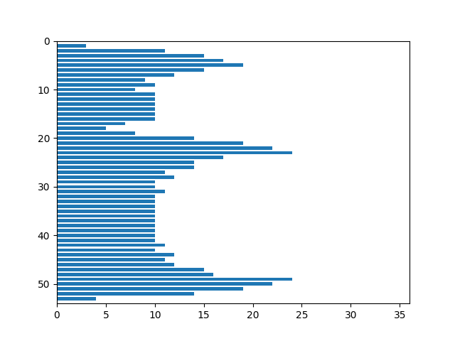

Признаки:
1. Вес чёрного = 647
2. Нормированный вес чёрного = 0.3487870619946092
3. Вес чёрного (I четверть) = 170
4. Нормированный вес чёрного (I четверть) = 0.38461538461538464
5. Вес чёрного (II четверть) = 153
6. Нормированный вес чёрного (II четверть) = 0.3269230769230769
7. Вес чёрного (III четверть) = 165
8. Нормированный вес чёрного (III четверть) = 0.35947712418300654
9. Вес чёрного (IV четверть) = 159
10. Нормированный вес чёрного (IV четверть) = 0.3271604938271605
11. Центр масс = (15.590417310664606, 26.814528593508502)
12. Нормированный центр масс = (0.42912992090190016, 0.4964332421828558)
13. Моменты инерции = (63794.460587326255, 156047.74343122097)
14. Нормированные моменты инерции = (0.01853937724582828, 0.04534920363299336)

### Буква დ

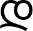  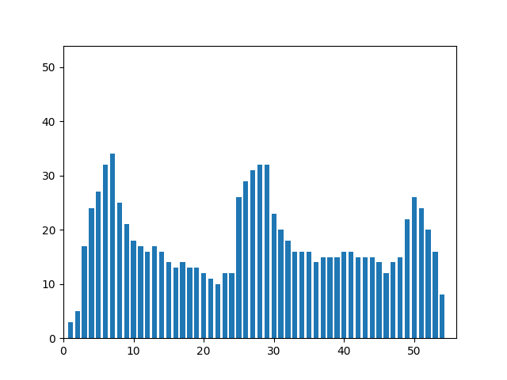 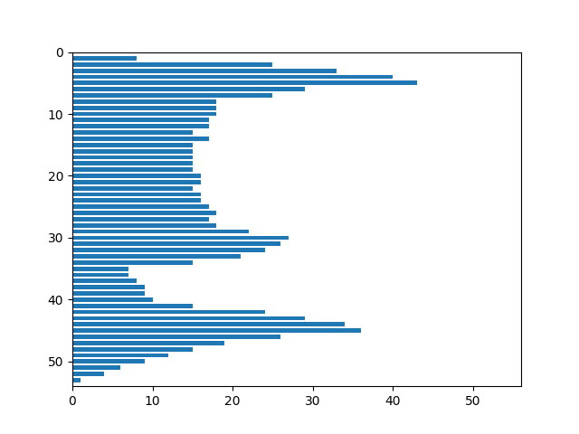

Признаки:
1. Вес чёрного = 962
2. Нормированный вес чёрного = 0.3300171526586621
3. Вес чёрного (I четверть) = 251
4. Нормированный вес чёрного (I четверть) = 0.3575498575498576
5. Вес чёрного (II четверть) = 261
6. Нормированный вес чёрного (II четверть) = 0.3585164835164835
7. Вес чёрного (III четверть) = 231
8. Нормированный вес чёрного (III четверть) = 0.3168724279835391
9. Вес чёрного (IV четверть) = 219
10. Нормированный вес чёрного (IV четверть) = 0.2896825396825397
11. Центр масс = (26.04781704781705, 23.502079002079004)
12. Нормированный центр масс = (0.46384846384846384, 0.4327322885015193)
13. Моменты инерции = (227955.80041579963, 226994.49584199826)
14. Нормированные моменты инерции = (0.026827087715789524, 0.02671395612591149)

### Буква ე

   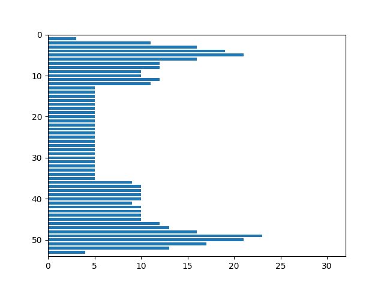

Признаки:
1. Вес чёрного = 485
2. Нормированный вес чёрного = 0.2951917224589166
3. Вес чёрного (I четверть) = 65
4. Нормированный вес чёрного (I четверть) = 0.16666666666666666
5. Вес чёрного (II четверть) = 158
6. Нормированный вес чёрного (II четверть) = 0.3798076923076923
7. Вес чёрного (III четверть) = 107
8. Нормированный вес чёрного (III четверть) = 0.2641975308641975
9. Вес чёрного (IV четверть) = 155
10. Нормированный вес чёрного (IV четверть) = 0.3587962962962963
11. Центр масс = (18.734020618556702, 27.0)
12. Нормированный центр масс = (0.5911340206185567, 0.5)
13. Моменты инерции = (44064.68865979362, 150032.0)
14. Нормированные моменты инерции = (0.01632358627993847, 0.055578749589268034)

### Буква ვ

   

Признаки:
1. Вес чёрного = 539
2. Нормированный вес чёрного = 0.3280584297017651
3. Вес чёрного (I четверть) = 102
4. Нормированный вес чёрного (I четверть) = 0.26153846153846155
5. Вес чёрного (II четверть) = 164
6. Нормированный вес чёрного (II четверть) = 0.3942307692307692
7. Вес чёрного (III четверть) = 107
8. Нормированный вес чёрного (III четверть) = 0.2641975308641975
9. Вес чёрного (IV четверть) = 166
10. Нормированный вес чёрного (IV четверть) = 0.38425925925925924
11. Центр масс = (16.93320964749536, 26.525046382189238)
12. Нормированный центр масс = (0.5311069882498454, 0.49086627658056226)
13. Моменты инерции = (40139.59554731, 154170.41187384058)
14. Нормированные моменты инерции = (0.01486955135929962, 0.05711180758511851)

### Буква ზ

   

Признаки:
1. Вес чёрного = 743
2. Нормированный вес чёрного = 0.29205974842767296
3. Вес чёрного (I четверть) = 313
4. Нормированный вес чёрного (I четверть) = 0.5016025641025641
5. Вес чёрного (II четверть) = 97
6. Нормированный вес чёрного (II четверть) = 0.15544871794871795
7. Вес чёрного (III четверть) = 133
8. Нормированный вес чёрного (III четверть) = 0.2052469135802469
9. Вес чёрного (IV четверть) = 200
10. Нормированный вес чёрного (IV четверть) = 0.30864197530864196
11. Центр масс = (23.199192462987888, 26.014804845222073)
12. Нормированный центр масс = (0.47232324389335933, 0.4810539393311937)
13. Моменты инерции = (128640.51951547795, 160100.83714670266)
14. Нормированные моменты инерции = (0.019876667432353775, 0.024737704011087665)

### Буква თ

   

Признаки:
1. Вес чёрного = 729
2. Нормированный вес чёрного = 0.3518339768339768
3. Вес чёрного (I четверть) = 174
4. Нормированный вес чёрного (I четверть) = 0.34523809523809523
5. Вес чёрного (II четверть) = 218
6. Нормированный вес чёрного (II четверть) = 0.43253968253968256
7. Вес чёрного (III четверть) = 178
8. Нормированный вес чёрного (III четверть) = 0.33458646616541354
9. Вес чёрного (IV четверть) = 159
10. Нормированный вес чёрного (IV четверть) = 0.29887218045112784
11. Центр масс = (27.068587105624143, 16.58299039780521)
12. Нормированный центр масс = (0.47397431101134807, 0.4328608443834781)
13. Моменты инерции = (204430.5706447184, 92239.22908093268)
14. Нормированные моменты инерции = (0.047617472403865845, 0.02148503979352683)

### Буква ი

   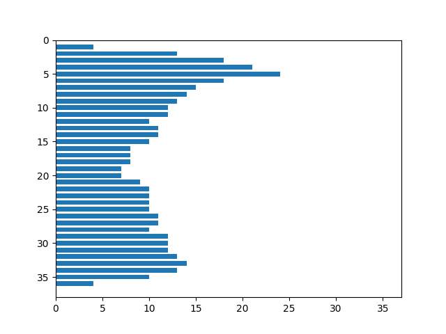

Признаки:
1. Вес чёрного = 415
2. Нормированный вес чёрного = 0.31156156156156156
3. Вес чёрного (I четверть) = 111
4. Нормированный вес чёрного (I четверть) = 0.3425925925925926
5. Вес чёрного (II четверть) = 119
6. Нормированный вес чёрного (II четверть) = 0.36728395061728397
7. Вес чёрного (III четверть) = 92
8. Нормированный вес чёрного (III четверть) = 0.26900584795321636
9. Вес чёрного (IV четверть) = 93
10. Нормированный вес чёрного (IV четверть) = 0.2719298245614035
11. Центр масс = (17.949397590361446, 16.14698795180723)
12. Нормированный центр масс = (0.48426850258175563, 0.4207496653279786)
13. Моменты инерции = (57479.93734939751, 47952.03373493976)
14. Нормированные моменты инерции = (0.03239722681544016, 0.027027046040939452)

### Буква კ

  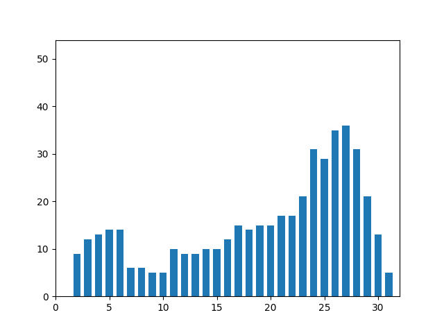 

Признаки:
1. Вес чёрного = 459
2. Нормированный вес чёрного = 0.2793670115642118
3. Вес чёрного (I четверть) = 25
4. Нормированный вес чёрного (I четверть) = 0.0641025641025641
5. Вес чёрного (II четверть) = 161
6. Нормированный вес чёрного (II четверть) = 0.3870192307692308
7. Вес чёрного (III четверть) = 107
8. Нормированный вес чёрного (III четверть) = 0.2641975308641975
9. Вес чёрного (IV четверть) = 166
10. Нормированный вес чёрного (IV четверть) = 0.38425925925925924
11. Центр масс = (18.47930283224401, 30.26797385620915)
12. Нормированный центр масс = (0.5826434277414669, 0.5628456510809452)
13. Моменты инерции = (31408.553376906268, 110206.0392156862)
14. Нормированные моменты инерции = (0.011635171983951639, 0.040825382963592276)

### Буква ლ

   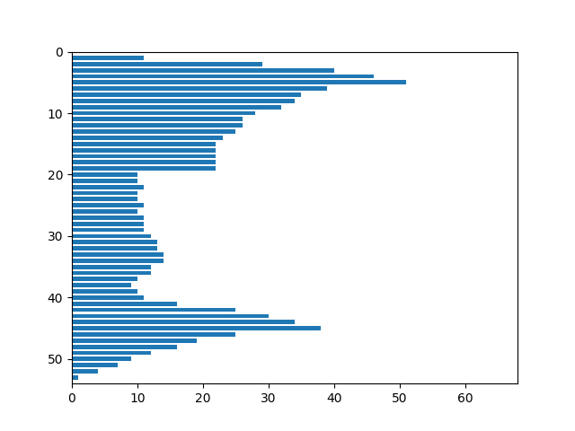

Признаки:
1. Вес чёрного = 1026
2. Нормированный вес чёрного = 0.28893269501548857
3. Вес чёрного (I четверть) = 308
4. Нормированный вес чёрного (I четверть) = 0.358974358974359
5. Вес чёрного (II четверть) = 319
6. Нормированный вес чёрного (II четверть) = 0.3608597285067873
7. Вес чёрного (III четверть) = 271
8. Нормированный вес чёрного (III четверть) = 0.3041526374859708
9. Вес чёрного (IV четверть) = 128
10. Нормированный вес чёрного (IV четверть) = 0.1394335511982571
11. Центр масс = (30.32261208576998, 21.244639376218323)
12. Нормированный центр масс = (0.44428200129954515, 0.38931998800419854)
13. Моменты инерции = (412004.21539961, 259343.59551656863)
14. Нормированные моменты инерции = (0.03267385029864228, 0.020567153196724357)

### Буква მ

   

Признаки:
1. Вес чёрного = 663
2. Нормированный вес чёрного = 0.379073756432247
3. Вес чёрного (I четверть) = 125
4. Нормированный вес чёрного (I четверть) = 0.3004807692307692
5. Вес чёрного (II четверть) = 208
6. Нормированный вес чёрного (II четверть) = 0.47058823529411764
7. Вес чёрного (III четверть) = 154
8. Нормированный вес чёрного (III четверть) = 0.35648148148148145
9. Вес чёрного (IV четверть) = 176
10. Нормированный вес чёрного (IV четверть) = 0.38344226579520696
11. Центр масс = (18.046757164404223, 26.520361990950228)
12. Нормированный центр масс = (0.532711161387632, 0.49077619213365825)
13. Моменты инерции = (66721.55052790359, 156763.47511312194)
14. Нормированные моменты инерции = (0.02181154910635975, 0.051246624343412095)

### Буква ნ

  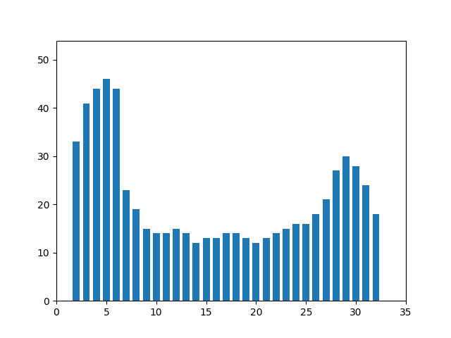 

Признаки:
1. Вес чёрного = 653
2. Нормированный вес чёрного = 0.3623751387347392
3. Вес чёрного (I четверть) = 204
4. Нормированный вес чёрного (I четверть) = 0.46153846153846156
5. Вес чёрного (II четверть) = 125
6. Нормированный вес чёрного (II четверть) = 0.2828054298642534
7. Вес чёрного (III четверть) = 170
8. Нормированный вес чёрного (III четверть) = 0.37037037037037035
9. Вес чёрного (IV четверть) = 154
10. Нормированный вес чёрного (IV четверть) = 0.3355119825708061
11. Центр масс = (14.378254211332312, 26.199081163859113)
12. Нормированный центр масс = (0.4054016427676458, 0.48459771468959834)
13. Моменты инерции = (67599.5712098009, 164146.11944869845)
14. Нормированные моменты инерции = (0.020817777758896854, 0.05054998683442692)

### Буква ო

   

Признаки:
1. Вес чёрного = 558
2. Нормированный вес чёрного = 0.32784958871915393
3. Вес чёрного (I четверть) = 179
4. Нормированный вес чёрного (I четверть) = 0.4323671497584541
5. Вес чёрного (II четверть) = 185
6. Нормированный вес чёрного (II четверть) = 0.4468599033816425
7. Вес чёрного (III четверть) = 99
8. Нормированный вес чёрного (III четверть) = 0.22654462242562928
9. Вес чёрного (IV четверть) = 95
10. Нормированный вес чёрного (IV четверть) = 0.21739130434782608
11. Центр масс = (22.63799283154122, 14.32078853046595)
12. Нормированный центр масс = (0.48084428514536043, 0.3700219036240542)
13. Моменты инерции = (126154.87455197147, 56773.578853046616)
14. Нормированные моменты инерции = (0.04354967562595587, 0.01959869527004472)

### Буква პ

   

Признаки:
1. Вес чёрного = 458
2. Нормированный вес чёрного = 0.2787583688374924
3. Вес чёрного (I четверть) = 57
4. Нормированный вес чёрного (I четверть) = 0.14615384615384616
5. Вес чёрного (II четверть) = 128
6. Нормированный вес чёрного (II четверть) = 0.3076923076923077
7. Вес чёрного (III четверть) = 107
8. Нормированный вес чёрного (III четверть) = 0.2641975308641975
9. Вес чёрного (IV четверть) = 166
10. Нормированный вес чёрного (IV четверть) = 0.38425925925925924
11. Центр масс = (17.445414847161572, 30.445414847161572)
12. Нормированный центр масс = (0.5481804949053858, 0.5662579778300303)
13. Моменты инерции = (31763.13537117904, 106609.13537117899)
14. Нормированные моменты инерции = (0.011766525454334955, 0.03949292443427491)

### Буква ჟ

   

Признаки:
1. Вес чёрного = 586
2. Нормированный вес чёрного = 0.35216346153846156
3. Вес чёрного (I четверть) = 122
4. Нормированный вес чёрного (I четверть) = 0.2932692307692308
5. Вес чёрного (II четверть) = 206
6. Нормированный вес чёрного (II четверть) = 0.4951923076923077
7. Вес чёрного (III четверть) = 108
8. Нормированный вес чёрного (III четверть) = 0.25961538461538464
9. Вес чёрного (IV четверть) = 150
10. Нормированный вес чёрного (IV четверть) = 0.3605769230769231
11. Центр масс = (18.600682593856654, 26.329351535836178)
12. Нормированный центр масс = (0.5677639546405372, 0.4966539516830623)
13. Моменты инерции = (53460.55972696312, 128179.43515358365)
14. Нормированные моменты инерции = (0.01930753619022279, 0.0462926145126374)

### Буква რ

   

Признаки:
1. Вес чёрного = 722
2. Нормированный вес чёрного = 0.29614438063986875
3. Вес чёрного (I четверть) = 206
4. Нормированный вес чёрного (I четверть) = 0.34448160535117056
5. Вес чёрного (II четверть) = 189
6. Нормированный вес чёрного (II четверть) = 0.31605351170568563
7. Вес чёрного (III четверть) = 165
8. Нормированный вес чёрного (III четверть) = 0.26570048309178745
9. Вес чёрного (IV четверть) = 162
10. Нормированный вес чёрного (IV четверть) = 0.2608695652173913
11. Центр масс = (22.134349030470915, 25.54016620498615)
12. Нормированный центр масс = (0.4696522006771314, 0.47192627317281055)
13. Моменты инерции = (144043.96814404477, 116547.33518005536)
14. Нормированные моменты инерции = (0.024234143450609535, 0.01960807436737158)

### Буква ს

   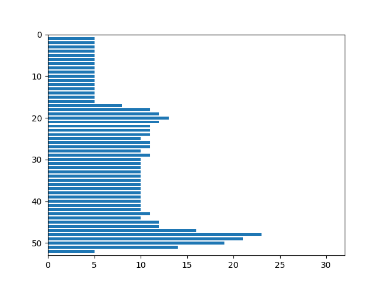

Признаки:
1. Вес чёрного = 495
2. Нормированный вес чёрного = 0.30707196029776673
3. Вес чёрного (I четверть) = 130
4. Нормированный вес чёрного (I четверть) = 0.3333333333333333
5. Вес чёрного (II четверть) = 60
6. Нормированный вес чёрного (II четверть) = 0.14423076923076922
7. Вес чёрного (III четверть) = 150
8. Нормированный вес чёрного (III четверть) = 0.38461538461538464
9. Вес чёрного (IV четверть) = 155
10. Нормированный вес чёрного (IV четверть) = 0.37259615384615385
11. Центр масс = (12.913131313131313, 30.18989898989899)
12. Нормированный центр масс = (0.39710437710437707, 0.5723509605862547)
13. Моменты инерции = (54095.2646464647, 98796.14949494935)
14. Нормированные моменты инерции = (0.02081752883401809, 0.038019810130191886)

### Буква ტ

   

Признаки:
1. Вес чёрного = 864
2. Нормированный вес чёрного = 0.302945301542777
3. Вес чёрного (I четверть) = 185
4. Нормированный вес чёрного (I четверть) = 0.2594670406732118
5. Вес чёрного (II четверть) = 277
6. Нормированный вес чёрного (II четверть) = 0.3884992987377279
7. Вес чёрного (III четверть) = 203
8. Нормированный вес чёрного (III четверть) = 0.2847124824684432
9. Вес чёрного (IV четверть) = 199
10. Нормированный вес чёрного (IV четверть) = 0.2791023842917251
11. Центр масс = (23.292824074074073, 31.75462962962963)
12. Нормированный центр масс = (0.4953960905349794, 0.5041742562234366)
13. Моменты инерции = (148426.91550925956, 264985.98148148175)
14. Нормированные моменты инерции = (0.01824793057666522, 0.03257795782707563)

### Буква უ

   

Признаки:
1. Вес чёрного = 723
2. Нормированный вес чёрного = 0.2728301886792453
3. Вес чёрного (I четверть) = 184
4. Нормированный вес чёрного (I четверть) = 0.28307692307692306
5. Вес чёрного (II четверть) = 271
6. Нормированный вес чёрного (II четверть) = 0.4169230769230769
7. Вес чёрного (III четверть) = 72
8. Нормированный вес чёрного (III четверть) = 0.10666666666666667
9. Вес чёрного (IV четверть) = 196
10. Нормированный вес чёрного (IV четверть) = 0.2903703703703704
11. Центр масс = (30.12448132780083, 21.76901798063624)
12. Нормированный центр масс = (0.594377169955119, 0.3994041919353123)
13. Моменты инерции = (148610.79668049727, 201374.4260027661)
14. Нормированные моменты инерции = (0.021162092798931616, 0.02867560356037965)

### Буква ფ

   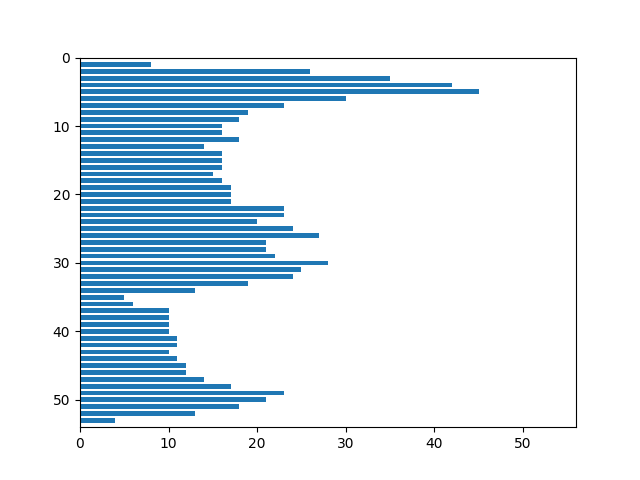

Признаки:
1. Вес чёрного = 958
2. Нормированный вес чёрного = 0.32864493996569466
3. Вес чёрного (I четверть) = 233
4. Нормированный вес чёрного (I четверть) = 0.3319088319088319
5. Вес чёрного (II четверть) = 324
6. Нормированный вес чёрного (II четверть) = 0.44505494505494503
7. Вес чёрного (III четверть) = 142
8. Нормированный вес чёрного (III четверть) = 0.19478737997256515
9. Вес чёрного (IV четверть) = 259
10. Нормированный вес чёрного (IV четверть) = 0.3425925925925926
11. Центр масс = (29.718162839248436, 22.589770354906054)
12. Нормированный центр масс = (0.5318178303564525, 0.41518789144050106)
13. Моменты инерции = (234851.90396659737, 222781.7797494781)
14. Нормированные моменты инерции = (0.02763865897002814, 0.026218180611844232)

### Буква ქ

   

Признаки:
1. Вес чёрного = 632
2. Нормированный вес чёрного = 0.2998102466793169
3. Вес чёрного (I четверть) = 62
4. Нормированный вес чёрного (I четверть) = 0.12156862745098039
5. Вес чёрного (II четверть) = 266
6. Нормированный вес чёрного (II четверть) = 0.4889705882352941
7. Вес чёрного (III четверть) = 113
8. Нормированный вес чёрного (III четверть) = 0.22156862745098038
9. Вес чёрного (IV четверть) = 191
10. Нормированный вес чёрного (IV четверть) = 0.35110294117647056
11. Центр масс = (20.28006329113924, 36.24683544303797)
12. Нормированный центр масс = (0.6426687763713079, 0.5260721707916115)
13. Моменты инерции = (53225.42879746839, 245487.493670886)
14. Нормированные моменты инерции = (0.011977824785462715, 0.05524438699030485)

### Буква ღ

  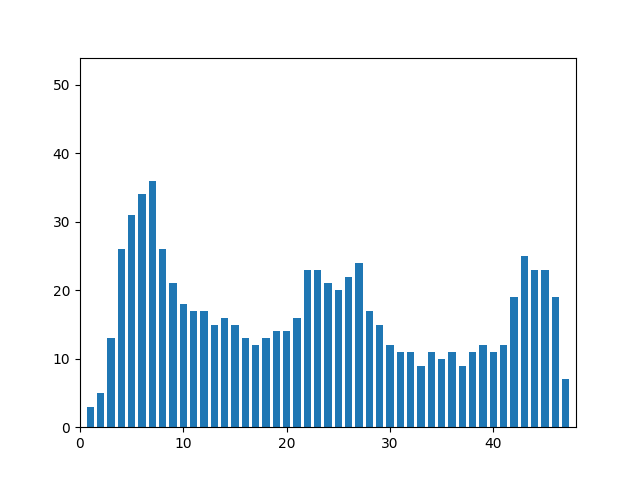 

Признаки:
1. Вес чёрного = 786
2. Нормированный вес чёрного = 0.31553592934564434
3. Вес чёрного (I четверть) = 211
4. Нормированный вес чёрного (I четверть) = 0.3528428093645485
5. Вес чёрного (II четверть) = 254
6. Нормированный вес чёрного (II четверть) = 0.40705128205128205
7. Вес чёрного (III четверть) = 210
8. Нормированный вес чёрного (III четверть) = 0.33816425120772947
9. Вес чёрного (IV четверть) = 111
10. Нормированный вес чёрного (IV четверть) = 0.1712962962962963
11. Центр масс = (21.673027989821882, 22.74681933842239)
12. Нормированный центр масс = (0.4494136519526496, 0.4182080642004306)
13. Моменты инерции = (146300.96819338403, 202008.61704834618)
14. Нормированные моменты инерции = (0.0235776081236303, 0.03255535536898651)

### Буква ყ

   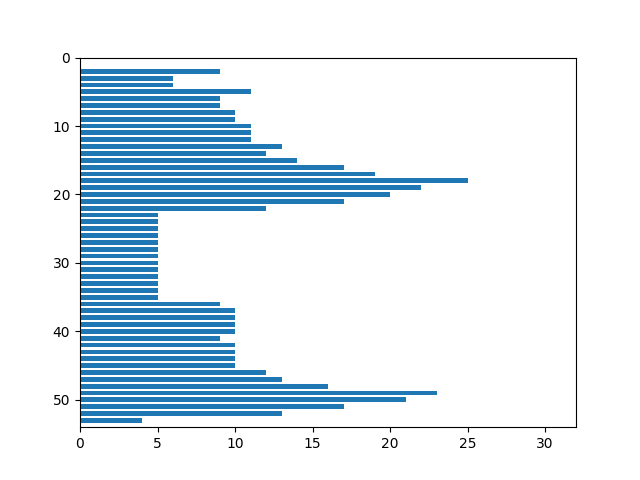

Признаки:
1. Вес чёрного = 556
2. Нормированный вес чёрного = 0.33840535605599514
3. Вес чёрного (I четверть) = 117
4. Нормированный вес чёрного (I четверть) = 0.3
5. Вес чёрного (II четверть) = 177
6. Нормированный вес чёрного (II четверть) = 0.4254807692307692
7. Вес чёрного (III четверть) = 107
8. Нормированный вес чёрного (III четверть) = 0.2641975308641975
9. Вес чёрного (IV четверть) = 155
10. Нормированный вес чёрного (IV четверть) = 0.3587962962962963
11. Центр масс = (17.758992805755394, 26.908273381294965)
12. Нормированный центр масс = (0.5586330935251798, 0.4982360265633647)
13. Моменты инерции = (54915.70503597125, 135276.32194244614)
14. Нормированные моменты инерции = (0.020343301553750876, 0.05011256813610709)

### Буква შ

  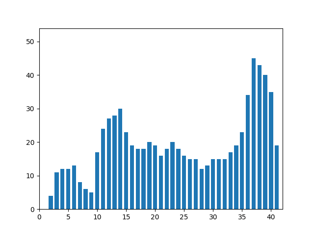 

Признаки:
1. Вес чёрного = 777
2. Нормированный вес чёрного = 0.35757017947537967
3. Вес чёрного (I четверть) = 172
4. Нормированный вес чёрного (I четверть) = 0.33076923076923076
5. Вес чёрного (II четверть) = 270
6. Нормированный вес чёрного (II четверть) = 0.4945054945054945
7. Вес чёрного (III четверть) = 142
8. Нормированный вес чёрного (III четверть) = 0.26296296296296295
9. Вес чёрного (IV четверть) = 193
10. Нормированный вес чёрного (IV четверть) = 0.3403880070546737
11. Центр масс = (23.656370656370655, 23.82754182754183)
12. Нормированный центр масс = (0.5664092664092664, 0.438991188991189)
13. Моменты инерции = (101485.25096525134, 195808.89060489062)
14. Нормированные моменты инерции = (0.02149232886925054, 0.04146798704616072)

### Буква ჩ

   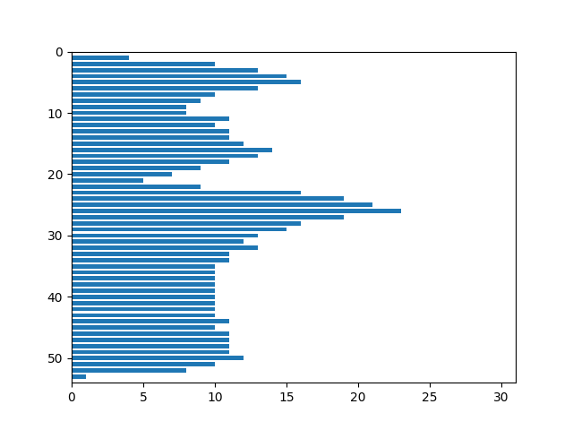

Признаки:
1. Вес чёрного = 604
2. Нормированный вес чёрного = 0.379874213836478
3. Вес чёрного (I четверть) = 223
4. Нормированный вес чёрного (I четверть) = 0.5717948717948718
5. Вес чёрного (II четверть) = 85
6. Нормированный вес чёрного (II четверть) = 0.21794871794871795
7. Вес чёрного (III четверть) = 154
8. Нормированный вес чёрного (III четверть) = 0.3802469135802469
9. Вес чёрного (IV четверть) = 142
10. Нормированный вес чёрного (IV четверть) = 0.3506172839506173
11. Центр масс = (11.746688741721854, 25.35927152317881)
12. Нормированный центр масс = (0.37057547385247774, 0.46844752929190014)
13. Моменты инерции = (45890.24337748354, 124265.0380794707)
14. Нормированные моменты инерции = (0.018152068105487734, 0.04915352955953906)

### Буква ც

   

Признаки:
1. Вес чёрного = 646
2. Нормированный вес чёрного = 0.3294237633860275
3. Вес чёрного (I четверть) = 131
4. Нормированный вес чёрного (I четверть) = 0.2799145299145299
5. Вес чёрного (II четверть) = 165
6. Нормированный вес чёрного (II четверть) = 0.3340080971659919
7. Вес чёрного (III четверть) = 154
8. Нормированный вес чёрного (III четверть) = 0.3168724279835391
9. Вес чёрного (IV четверть) = 196
10. Нормированный вес чёрного (IV четверть) = 0.3820662768031189
11. Центр масс = (17.944272445820435, 27.46594427244582)
12. Нормированный центр масс = (0.4706742346061232, 0.5089604667778043)
13. Моменты инерции = (83955.99380804959, 147058.75077399387)
14. Нормированные моменты инерции = (0.0218321506521612, 0.03824156746874972)

### Буква ძ

   

Признаки:
1. Вес чёрного = 560
2. Нормированный вес чёрного = 0.32018296169239563
3. Вес чёрного (I четверть) = 66
4. Нормированный вес чёрного (I четверть) = 0.15865384615384615
5. Вес чёрного (II четверть) = 176
6. Нормированный вес чёрного (II четверть) = 0.39819004524886875
7. Вес чёрного (III четверть) = 151
8. Нормированный вес чёрного (III четверть) = 0.34953703703703703
9. Вес чёрного (IV четверть) = 167
10. Нормированный вес чёрного (IV четверть) = 0.3638344226579521
11. Центр масс = (18.50357142857143, 29.985714285714284)
12. Нормированный центр масс = (0.5469866071428572, 0.5574175824175824)
13. Моменты инерции = (58431.992857143036, 104847.88571428545)
14. Нормированные моменты инерции = (0.019101658632064204, 0.034275204785577204)

### Буква წ

  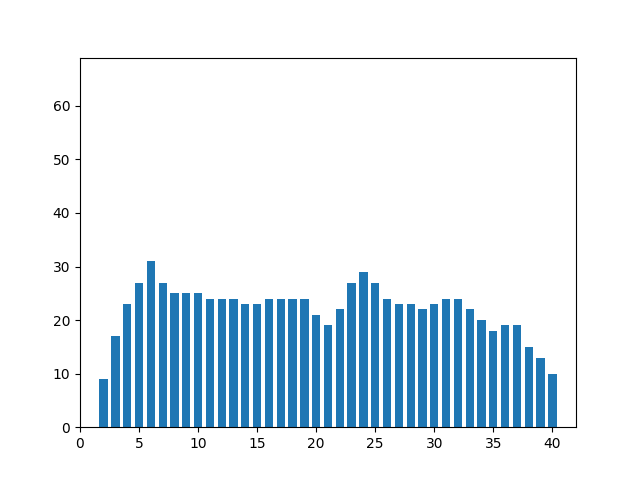 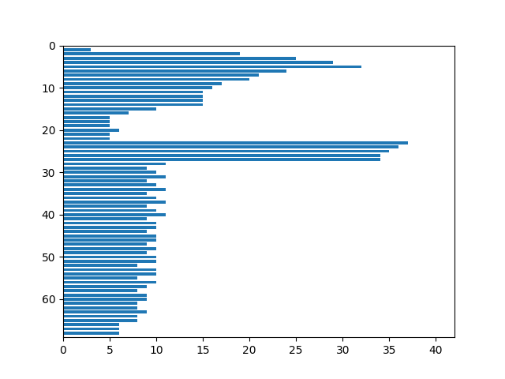

Признаки:
1. Вес чёрного = 867
2. Нормированный вес чёрного = 0.31097560975609756
3. Вес чёрного (I четверть) = 288
4. Нормированный вес чёрного (I четверть) = 0.4235294117647059
5. Вес чёрного (II четверть) = 273
6. Нормированный вес чёрного (II четверть) = 0.38235294117647056
7. Вес чёрного (III четверть) = 156
8. Нормированный вес чёрного (III четверть) = 0.22941176470588234
9. Вес чёрного (IV четверть) = 150
10. Нормированный вес чёрного (IV четверть) = 0.21008403361344538
11. Центр масс = (19.162629757785467, 27.630911188004614)
12. Нормированный центр масс = (0.45406574394463667, 0.39747628638812854)
13. Моменты инерции = (97302.06920415202, 309369.8915801616)
14. Нормированные моменты инерции = (0.012518045827186202, 0.039800864586205895)

### Буква ჭ

   

Признаки:
1. Вес чёрного = 789
2. Нормированный вес чёрного = 0.3516042780748663
3. Вес чёрного (I четверть) = 155
4. Нормированный вес чёрного (I четверть) = 0.2849264705882353
5. Вес чёрного (II четверть) = 231
6. Нормированный вес чёрного (II четверть) = 0.39965397923875434
7. Вес чёрного (III четверть) = 154
8. Нормированный вес чёрного (III четверть) = 0.28308823529411764
9. Вес чёрного (IV четверть) = 249
10. Нормированный вес чёрного (IV четверть) = 0.43079584775086505
11. Центр масс = (17.043092522179975, 35.18631178707224)
12. Нормированный центр масс = (0.5013466413181242, 0.5102434595085409)
13. Моменты инерции = (53580.534854245845, 280073.6121673008)
14. Нормированные моменты инерции = (0.010640482930565057, 0.0556194240627613)

### Буква ხ

  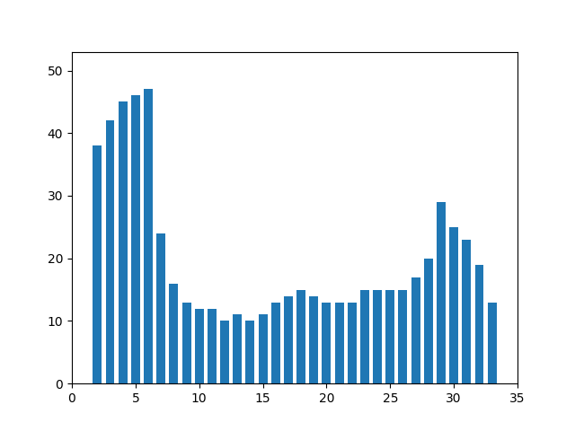 

Признаки:
1. Вес чёрного = 638
2. Нормированный вес чёрного = 0.3608597285067873
3. Вес чёрного (I четверть) = 201
4. Нормированный вес чёрного (I четверть) = 0.45475113122171945
5. Вес чёрного (II четверть) = 122
6. Нормированный вес чёрного (II четверть) = 0.27601809954751133
7. Вес чёрного (III четверть) = 163
8. Нормированный вес чёрного (III четверть) = 0.36877828054298645
9. Вес чёрного (IV четверть) = 152
10. Нормированный вес чёрного (IV четверть) = 0.3438914027149321
11. Центр масс = (14.294670846394984, 27.246081504702193)
12. Нормированный центр масс = (0.40286881352712073, 0.5146290491118077)
13. Моменты инерции = (69766.6018808775, 123236.3652037618)
14. Нормированные моменты инерции = (0.022319427415259944, 0.03942524121759952)

### Буква ჯ

   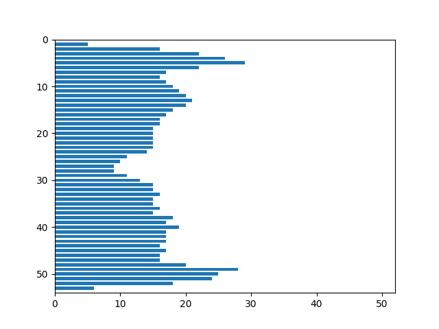

Признаки:
1. Вес чёрного = 885
2. Нормированный вес чёрного = 0.3274139844617092
3. Вес чёрного (I четверть) = 216
4. Нормированный вес чёрного (I четверть) = 0.3323076923076923
5. Вес чёрного (II четверть) = 229
6. Нормированный вес чёрного (II четверть) = 0.33875739644970415
7. Вес чёрного (III четверть) = 205
8. Нормированный вес чёрного (III четверть) = 0.3037037037037037
9. Вес чёрного (IV четверть) = 235
10. Нормированный вес чёрного (IV четверть) = 0.33475783475783477
11. Центр масс = (25.980790960451976, 25.805649717514125)
12. Нормированный центр масс = (0.4996158192090395, 0.4770317253368101)
13. Моменты инерции = (176686.6734463275, 226464.5717514123)
14. Нормированные моменты инерции = (0.02418308502348174, 0.03099618033804019)

### Буква ჰ

  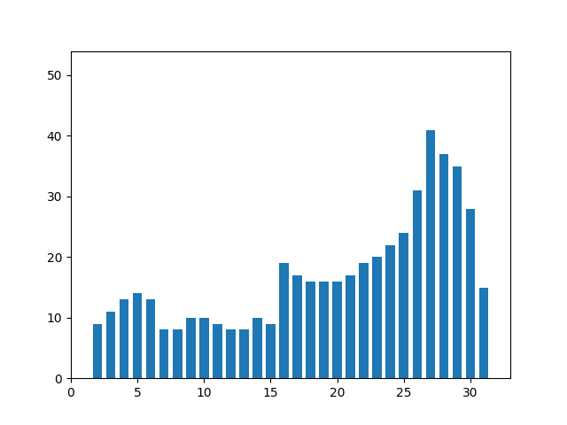 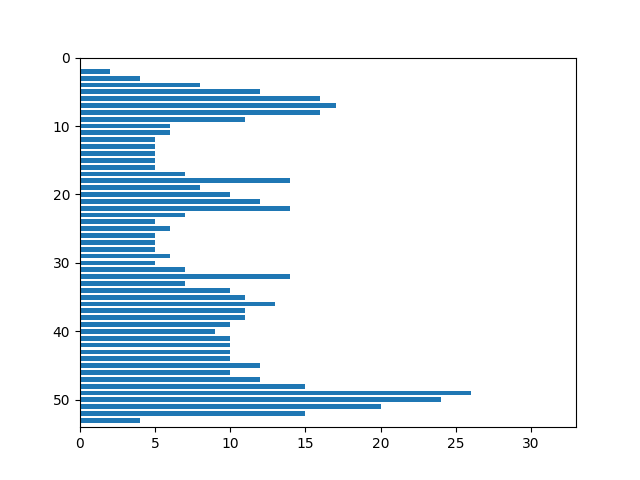

Признаки:
1. Вес чёрного = 513
2. Нормированный вес чёрного = 0.30247641509433965
3. Вес чёрного (I четверть) = 45
4. Нормированный вес чёрного (I четверть) = 0.10817307692307693
5. Вес чёрного (II четверть) = 166
6. Нормированный вес чёрного (II четверть) = 0.39903846153846156
7. Вес чёрного (III четверть) = 114
8. Нормированный вес чёрного (III четверть) = 0.2638888888888889
9. Вес чёрного (IV четверть) = 188
10. Нормированный вес чёрного (IV четверть) = 0.4351851851851852
11. Центр масс = (19.023391812865498, 29.415204678362574)
12. Нормированный центр масс = (0.581399735898887, 0.5464462438146649)
13. Моменты инерции = (36757.7192982457, 128034.56140350887)
14. Нормированные моменты инерции = (0.012778999733781797, 0.04451183744058887)
